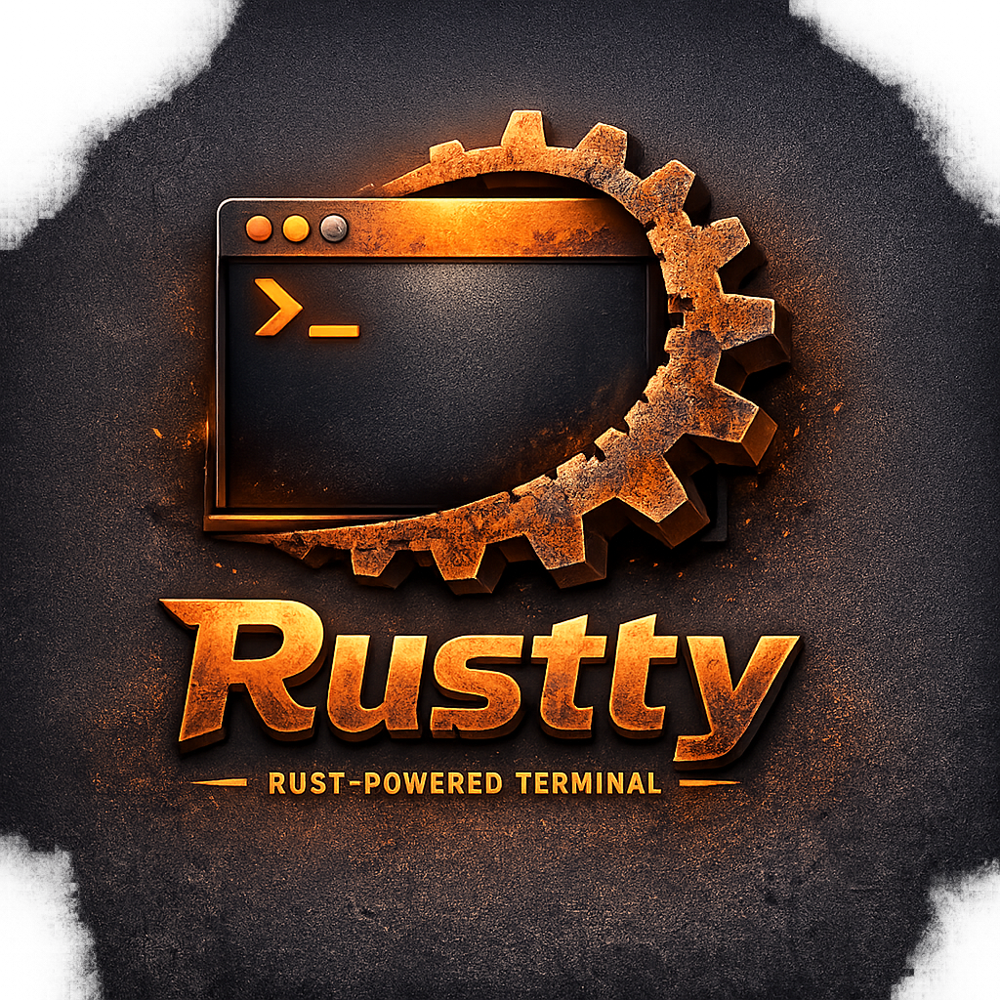

<div align="center">



# Rustty

A GPU-accelerated terminal emulator written in Rust.

[](LICENSE)
[](https://www.rust-lang.org/)
[](https://www.apple.com/macos/)

</div>

---

## About

Rustty is a native GUI terminal emulator that opens its own window with a shell session, full ANSI color support, and cursor rendering. Built with Rust for performance and reliability.

## Features

- Native GPU-accelerated GUI window (not console-based)
- 80x24 terminal grid with block cursor
- ANSI color support: 16 standard, 256 extended, and 24-bit true color
- Escape sequence handling: cursor movement, erase, scroll, insert/delete, SGR styling
- Keyboard input: printable characters, special keys, and Ctrl+A-Z
- Spawns your default `$SHELL`

## Prerequisites

- [Rust](https://www.rust-lang.org/tools/install) (2024 edition)
- macOS 10.15 (Catalina) or later

## Getting Started

### Clone the repository

```sh
git clone https://github.com/msiShariful/rustty.git
cd rustty
```

### Build and run

```sh
cargo run
```

For a release build:

```sh
cargo build --release
./target/release/rustty
```

## Build macOS .dmg

Create a distributable macOS disk image with a single command:

```sh
./build-dmg.sh
```

### Requirements

```sh
cargo install cargo-bundle          # required
brew install create-dmg             # optional, for drag-to-Applications layout
```

### What the script does

1. Compiles an optimized release binary
2. Creates a `Rustty.app` bundle with icon
3. Packages it into `Rustty.dmg`

If `create-dmg` is not installed, it falls back to `hdiutil`.

> **Note:** The DMG is built for your current architecture (Intel or Apple Silicon). It is not code-signed or notarized, so recipients may need to right-click → Open on first launch.

## Project Structure

```
src/
├── main.rs    — Entry point: PTY setup, reader thread, eframe launch
├── app.rs     — TerminalApp and eframe rendering/input dispatch
├── grid.rs    — Cell, TerminalGrid, and VTE ANSI escape sequence handling
├── input.rs   — Keyboard-to-byte mapping (Ctrl keys, special keys)
└── theme.rs   — Color constants and 256-color palette
```

## Dependencies

| Crate | Purpose |
|-------|---------|
| [eframe](https://github.com/emilk/egui/tree/master/crates/eframe) | Native GUI window and rendering via egui |
| [portable-pty](https://github.com/nickelc/portable-pty) | Cross-platform PTY creation and management |
| [vte](https://github.com/alacritty/vte) | ANSI/VT escape sequence parsing |
| [image](https://github.com/image-rs/image) | App icon loading |

## License

This project is licensed under the MIT License. See the [LICENSE](LICENSE) file for details.
